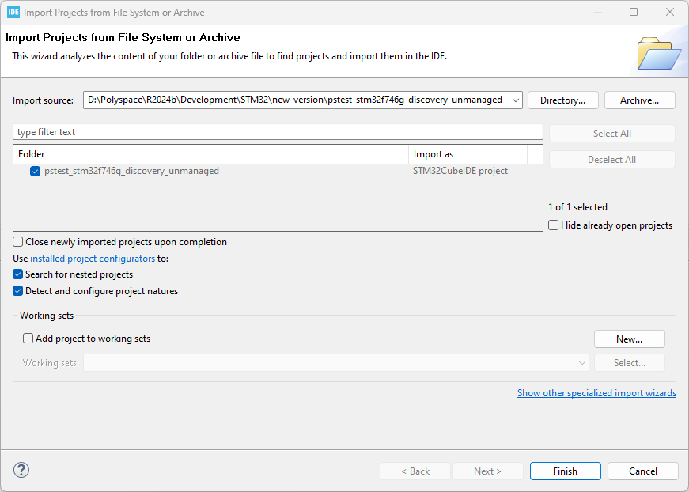
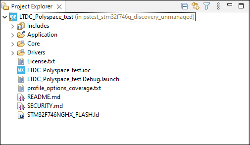
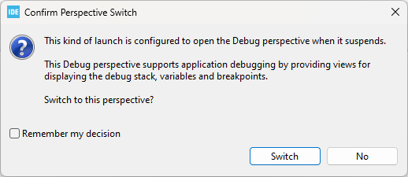
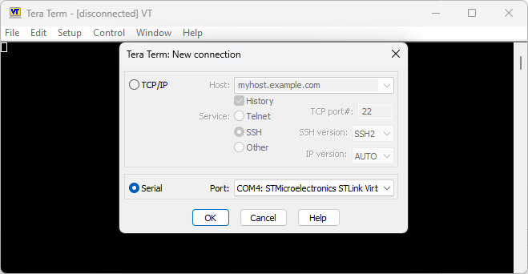
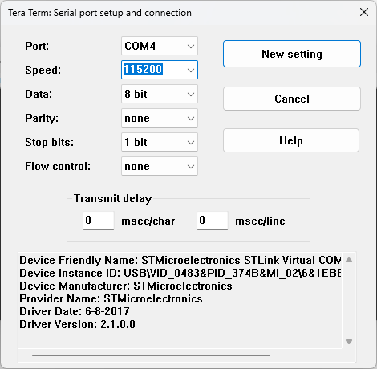
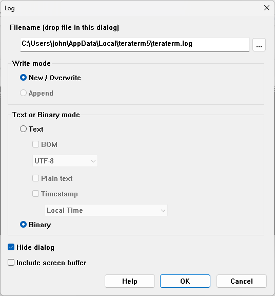

# Running C/C++ Tests and Collecting Coverage on STM32 Discovery Board Using Polyspace Test

## Overview

This repository contains an STM32CubeIDE project that is set up to do the following: 

* Run some sample C/C++ tests written using the Polyspace Test xUnit API on an STM32F746G Discovery board 
* Collect coverage data after test execution using the polyspace-code-profiler command (available with Polyspace Test).  

## Run Demo Project Using Your Polyspace Test Installation

To adapt the project to your Polyspace Test installation and run the tests or get coverage results, download the project and follow these steps:

1. Clone the Git repository into a folder `pstest_stm32f746g_discovery_unmanaged`. 

2. Open the STM32CubeIDE interface. Select **File** > **Open Projects from File System**.   
Add the folder `pstest_stm32f746g_discovery_unmanaged` to the **Import Source** field.<br><br>


3. Click **Finish**. On the **Project Explorer** pane, you see a project with these folders: 
- **Application**: This folder contains the sources, tests written using the Polyspace Test xUnit API, and files required for collecting coverage.
- **Core**: Contains the `main` function, and specific libraries to drive the lcd screen.
- **Drivers**: Contains the strandard Hardware abstraction layer of STM32.<br><br>

<br><br>
This project has been created by adapting an example STM32CubeIDE project to run tests and collect coverage data. The adaptations are described in the next section.

4. Modify the project properties to point to your Polyspace Test installation. On the **Project Explorer** pane, right-click the project node and select **Properties**.

5. On the Properties window:
- Select **Resource** > **Linked Resources**.
 Change the value of the variable `PSTEST`, which is currently set to `C:\Program Files\Polyspace\R2023b`, to your Polyspace installation folder.
- Select **C/C++ Build** > **Environment**. 
Change the value of the variable `PSTEST` to your Polyspace installation folder.

6. Click the Debug icon  to start the build.
If prompted to switch to the Debug perspective, select **Switch**.<br><br>
 

7. Click the Resume icon  to run the application on the STM32F746G board.  
The results of test execution appear on the LCD screen of the board.

8. This project is set up to collect coverage data after execution on target. 
To log the coverage data, you can use a terminal emulator like [Tera Term](https://sourceforge.net/projects/tera-term/).
 - Open a new connection in Tera Term to receive data from the STM32F746G board over a serial port. <br><br>
 
 - Set up your serial port connection to a baud rate of 115200. In Tera Term, you can do this by selecting **Setup** > **Serial Port**. Set **Speed** to 115200 and then click **New Setting** to save this setting. <br><br>
 
 - Log the data in binary form. In Tera Term, you can do this by selecting **File** > **Log**. In the log settings, note the log file location. In the section **Text or Binary mode**, select **Binary**,  and then click **OK**.<br><br>
 
 - In the STM32CubeIDE, repeat steps 6 and 7.
 Once you see the results on test execution on the LCD screen of the board, stop logging. In Tera Term, you can do this by selecting **File** > **Stop Logging**.

 9. Convert the log file generated in the previous step into a `.bin` file. For example, if your log file is named `teraterm.log`, in Windows, at the command line, rename it by using this command:
 ```
 move teraterm.log teraterm.bin
 ```
10. To open the coverage results in the Polyspace Platform user interface, convert the `.bin` file into a `.psprof` file using the `polyspace-code-profiler` or `polyspace-test` command. For example, to convert the file `teraterm.bin`, enter this command at the command line:
```
polyspace-code-profiler -convert -instrum-dir instrumDir -results-dir resDir teraterm.bin
```
You can then open the `.psprof` file in the Polyspace Platform user interface and review the coverage results. For more information, see [Review C/C++ Coverage Metrics](https://www.mathworks.com/help/polyspace_test/ug/review-test-coverage-in-polyspace-test-user-interface.html).


For more information on the commands used, see:
- [polyspace-code-profiler](https://www.mathworks.com/help/polyspace_test/ref/polyspacecodeprofiler.html)
- [polyspace-test](https://www.mathworks.com/help/polyspace_test/ref/polyspacetest.html)

## Explore Demo Project 

This project is adapted from a standard STM32CubeIDE project to make it suitable for coverage data collection. This section describes the adaptations in some detail. You can make similar adaptations to your own projects for running tests on an STM32 development board, and collecting coverage.

### `main` Function

Since the execution of user code begins from the `main()` function, to understand how the project is set up, you can begin exploring from the `main()`.

1. On the **Project Explorer** pane, open the file **Core** > **Src** > **main.c**. 
2. In the body of the `main()` function, note the following lines or their equivalent. These lines are used to execute the tests registered via the registration function `registerTests`. The registration function is defined in the test files (see later).
```
  PST_REGFCN_CALL(registerTests);
  PST_MAIN(0, NULL);
```

3. Note the call to the `psprofile_stream()` function following the test execution. This function triggers streaming of code coverage data after test execution on target.

For more information on test registration, see [Write C or C++ Unit Test Using Polyspace Test xUnit API and Run Tests at Command Line
](https://www.mathworks.com/help/polyspace_test/gs/write-simple-c-or-c-unit-test-using-polyspace-test-api.html).

### Sources

This project contains some simple source files in the folder `Application\sources`. To see that the folder `Application` has been included in the build:

1. On the **Project Explorer** pane, right-click the project node and select **Properties**.

2. Select **C/C++ General > Paths and Symbols**. On the **Source Location** tab, you can see which folders are included in the build.

The source files include a header that is in the subfolder `Application\inc`.

### Tests

The functions in the folder `Application\sources` are tested using xUnit tests in the folder `Application\tests`. 

Open the file `profilingTests.c` to see examples of tests written using the Polyspace Test xUnit API. The tests use macros declared in the header `pstunit.h` available in a Polyspace Test installation. The path to this header is included as an include path during project build (see later).

For more information on the xUnit API, see [Author Tests Using C/C++ xUnit API
](https://www.mathworks.com/help/polyspace_test/create-and-run-xunit-based-tests-at-the-command-line.html).

### Configuration Files for Tests

To display test execution results on the LCD screen of the board, additional customization is required. This customization is done using files `pstunit_config.c` and `pstunit_config.h` in the folder `Application\pstest_configuration`.

The header file `pstunit_config.h` defines these macros:
* `PST_OUTPUT` is set to `PST_OUTPUT_TABLE` to output results in a tabular format on the LCD screen. For more information on result formats, see [Results Format of Tests Written Using Polyspace Test API
](https://www.mathworks.com/help/polyspace_test/ug/format-of-test-execution-results-on-using-polyspace-test-api.html).
* `PST_WRITE`, `PST_FLUSH`, and `PST_PRINTF` are set to functions that stream data to the LCD screen. The functions are defined in the file `pstunit_config.c`.

To make sure that these configuration files are used during test execution, the preprocessor define `PST_USER_CONFIG_FILE` is added during project build (see later).

### Configuration Files for Code Profiling

To stream coverage data from the board back to the host, additional customization is required. This customization is done using files `psprofile_config.c` and `psprofile_config.h` in the folder `Application\pstest_configuration`. These files use macros defined in the file `psprofile_internal.c` (available with a Polyspace Test installation and added as a linked resource in the project in the folder `Application\pstest_configuration`). 

The header file `psprofile_config.h` defines these macros:
* `PSPROFILE_SENDING_TYPE` is set to 2. This requires you to define your own functions for initiating a connection between host and target, and streaming data.
* `PSPROFILE_SENDING_INIT`, `PSPROFILE_SENDING_DATA_ASYNC`, `PSPROFILE_SENDING_DATA_WAIT`, and `PSPROFILE_SENDING_END` are set to functions that initiate a connection between host and target, and stream coverage data from the target back to the host.  The functions are defined in the file `pstprofile_config.c`.
* `PSPROFILE_EXECPROF_AVAILABLE` is defined and `PSPROFILE_GET_TIMESTAMP` is set to a counter function that allows execution profiling. To perform execution profiling instead of coverage calculation, you have to replace `-cov-metric-level mcdc` in the options file `profile_options_coverage.txt` with `-exec-metric-level standard` (for more information on the options file for coverage, see later).
* `PSPROFILE_STACKPROF_AVAILABLE` is defined and `PSPROFILE_GET_STACKPTR` is set to a function that returns the current stack pointer and allows memory profiling. To perform memory profiling instead of coverage calculation, you have to replace `-cov-metric-level mcdc` in the options file `profile_options_coverage.txt` with `-stack-metric-level standard` (for more information on the options file for coverage, see later).

To make sure that these files are used during test execution, the preprocessor define `PST_USER_CONFIG_FILE` is added during project build (see later).

### Include Paths, Preprocessor Defines and Other Build Settings

The test files and configuration files added to the project use macros that are available with a Polyspace Test installation. To make sure that the macro definitions are available during project build, the project properties have been modified appropriately. To see the modifications:

1. On the **Project Explorer** pane, right-click the project node and select **Properties**.

2. Select **C/C++ Build > Settings**. <br> On the **Tool Settings** tab, select **MCU GCC Compiler**. You can see the following entry for **Command line pattern**. The part following `--` is the actual build command while the part preceding `--` uses the build command to instrument source files for coverage (and later runs the build command with instrumented sources to create the test executable).
```
"${PSTEST}/polyspace/bin/polyspace-code-profiler.exe" -instrument -options-file ../profile_options_coverage.txt -- ${COMMAND} ${INPUTS} ${FLAGS} ${OUTPUT_FLAG} ${OUTPUT_PREFIX}${OUTPUT}
```

3. On the **Tool Settings** tab, select **MCU GCC Compiler > Include paths**. You can see the following include paths added to the project (in addition to other paths). These paths enable inclusion of header files shipped with a Polyspace Test installation. Note the use of the variable `PSTEST` that you had changed in the earlier section to point to your Polyspace installation folder.

* `"${PSTEST}/polyspace/pstest/pstunit/include"`
* `"${PSTEST}/polyspace/pstest/pstunit/src"`
* `"${PSTEST}/polyspace/psprofile/include"`

4. On the **Tool Settings** tab, select **MCU GCC Compiler > Preprocessor**. You can see the preprocessor define `PST_USER_CONFIG_FILE`. This macro allows the configuration files for tests and profiling to be used during project build.

### Options File for Code Profiling


The command `polyspace-code-profiler` that runs during project build uses an options file `profile_options_coverage.txt` to instrument the sources for coverage calculation. This file is stored in the root folder of the project.

The options file uses these options:

* `-limit-instrumentation-to` to limit instrumentation to source files only.
* `-instrum-dir` to store the results in a folder `instrumDir` that is part of the project.
* `-cov-metric-level` to specify what coverage level is desired. You can change this option to `-exec-metric-level` or `stack-metric-level` to perform execution or memory profiling of the sources.

For more information on the options, see [polyspace-code-profiler](https://www.mathworks.com/help/polyspace_test/ref/polyspacecodeprofiler.html).


